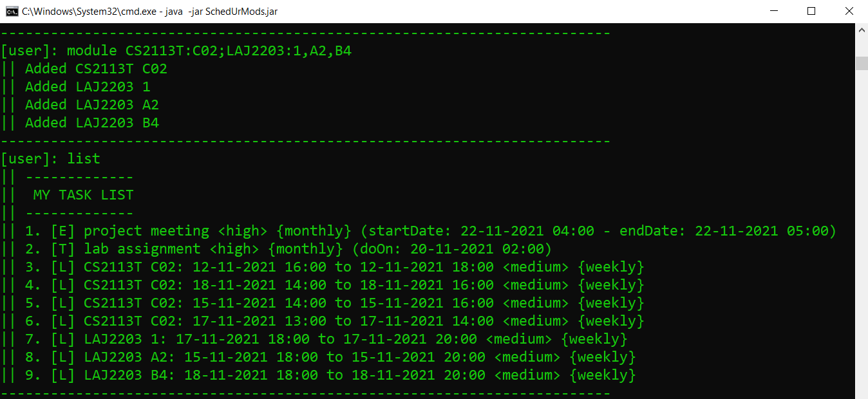

    

# SchedUrMods User Guide

---

**Welcome to SchedUrMods User Guide!**

SchedUrMods is a desktop application that simplifies task and timetable
management for NUS students through the use of a virtual task list.

SchedUrMods is optimised for usage via a Command Line Interface (CLI). If you are
someone that can type fast, SchedUrMods can definitely help you manage your NUS semester 
faster than a traditional GUI application.

**What is the purpose of this User Guide?**
- Introduce you to SchedUrMods features.
- Provide you with instructions on how to use SchedUrMods.
- Provide troubleshooting for issues you may face when using SchedUrMods.

**How to use this User Guide?**

This guide has **4 main sections**, and it is highly recommended follow
the sections of the user guide in the order as detailed below if you are a new user.

> - [1. Getting Started](#1-getting-started): A simple step-by-step installation guide for SchedUrMods.
>   - This section provides instructions for new users who wish to set up SchedUrMods on their device. 

> - [2. Features](#2-features): A comprehensive list of all features in SchedUrMods.
>   - This section provides detailed information for users who want to find out more about each command and how to use them.

> - [3. FAQ](#3-faq): A list of commonly asked questions for SchedUrMods. 
>   - This section provides useful information for users who are troubleshooting issues when using SchedUrMods.

> - [4. Command Summary](#4-command-summary): A summarised table containing all available commands
and features of SchedUrMods. 
>   - This section provides a quick refresher for users who are already familiar with the features of SchedUrMods.

---

# Overview 

**This section contains the outline of the SchedUrMods User Guide.**

By clicking on the title of any particular section, you will be automatically navigated to the 
desired section located within the User Guide.

---

- [1. Getting Started](#1-getting-started)
  - [1.1 Device Requirements](#11-device-requirements)
  - [1.2 Setting Up SchedUrMods](#12-setting-up-schedurmods)
- [2. Features](#2-features)
    - [2.1 Viewing help: `help`](#21-viewing-help--help)
    - [2.2 Adding your tasks:](#22-adding-your-tasks)
      - [2.2.1 Todo: `todo`](#221-todo-todo)
      - [2.2.2 Deadline: `deadline`](#222-deadline-deadline)
      - [2.2.3 Event: `event`](#223-event-event)
      - [2.2.4 Date Format: `<dateFormat>`](#224-date-format-dateformat)
    - [2.3 Listing your task list: `list`](#23-listing-your-tasks-list)
      - [2.3.1 Listing your entire task list](#231-listing-your-entire-task-list)
      - [2.3.2 Filtering your task list](#232-filtering-your-task-list)
      - [2.3.3 Listing the recurrence of a task](#233-listing-the-recurrence-of-a-task)
      - [2.3.4 Listing your upcoming tasks: `upcoming`](#234-listing-your-upcoming-tasks-upcoming)
    - [2.4 Sorting your task list: `sort`](#24-sorting-your-task-list-sort)
    - [2.5 Editing your tasks: `edit`](#25-editing-your-tasks-edit)
    - [2.6 Adding your NUS timetable:](#26-adding-your-nus-timetable)
      - [2.6.1 Module: `module`](#261-module-module)
      - [2.6.2 Browse: `browse`](#262-browse-browse)
    - [2.7 Deleting your tasks: `delete`](#27-deleting-your-tasks-delete)
    - [2.8 Exiting the program: `bye`](#28-exiting-the-program-bye)
    - [2.9 Saving your task list](#29-saving-your-task-list)
- [3. FAQ](#3-faq)
- [4. Command Summary](#4-command-summary)

# 1. Getting Started
This section will bring you through a step-by-step guide on how to 
install the SchedUrMods application on your computer.

---

## 1.1 Device Requirements

This section serves to ensure you have installed all additional pieces of software required to run the SchedUrMods application. 

**Please kindly follow the instructions below to install all necessary software:**

- **Step 1:** Download and install `Java 11` on your computer.
  - If you are using Windows, click [here](https://corretto.aws/downloads/latest/amazon-corretto-11-x64-windows-jdk.msi) to download.
  - If you are using Macintosh, click [here](https://corretto.aws/downloads/latest/amazon-corretto-11-x64-macos-jdk.pkg) to download.
  - If you are using Linux, click [here](https://corretto.aws/downloads/latest/amazon-corretto-11-x64-linux-jdk.deb) to download.

  >💡 **Tip:** If you are unsure on how to install `Java 11` on your computer, click [here](https://www.youtube.com/watch?v=-p0NTsSHlxg) for a short video tutorial.

&nbsp;

- **Step 2:** After successfully installing `Java 11`, open up a **command prompt** on your computer.

  >💡 **Tip:** If you are unsure on how to open a **command prompt** on your computer, click [here](https://www.digitalcitizen.life/open-cmd/) for a quick guide.

&nbsp;

- **Step 3:** Type `java --version` into the **command prompt** and check that the version number is `11.0.12`, as shown in the example below.
  

  

      
  

&nbsp;

- **Step 4:** If the version number matches, you have succeeded in installing `Java 11` on your device.

## 1.2 Setting Up SchedUrMods

This section serves to provide a step-by-step guide to download and install the official **SchedUrMods** application.

**Please kindly follow the instructions below to set up the SchedUrMods application:**

- **Step 1:** Download the latest version of SchedUrMods [here](https://github.com/AY2122S1-CS2113T-W13-3/tp/releases/latest) and click 
on `SchedUrMods.jar` as shown in the image below.

  

      
  

&nbsp;

- **Step 2:** Create an empty folder called 'SchedUrMods', and copy the downloaded application into it.

&nbsp;

- **Step 3:** In the 'SchedUrMods' folder, type `cmd` on the File Explorer Bar to launch a **command prompt** as shown below.

  

      
  

&nbsp;

- **Step 4:** Type `java -jar SchedUrMods.jar` into the command prompt to start the SchedUrMods application.
  The following display should appear in a few seconds.

  

      
  

&nbsp;

- **Step 5:** Congratulations, have successfully installed SchedUrMods! You may now start using SchedUrMods
to build your very own virtual task list.

&nbsp;

Please refer to the [Features](#2-features) section of the User Guide for more details of the commands available.

# 2. Features
This section teaches you all the commands you can use to manage your very 
own virtual task list in the SchedUrMods application.

---

&nbsp;

> #### 📝 **Notes about the command format**:
> - All commands are case-insensitive. For example, `todo` is the same as `Todo` or `TODO`.
> - Command arguments within `< >` are **mandatory** fields.
> - Command arguments within `[ ]` are **optional** fields and may be arranged in any order.
> - Command arguments such as `<a|b|c>` or `[a|b|c]` means that the argument must **strictly** either be `a`, `b` or `c`.

&nbsp;

## **2.1 Viewing help :** `help`
Displays all available commands for the SchedUrMods application.

**Format:** `help`

&nbsp;

## 2.2 Adding your tasks:
There are **3 types of tasks** you can add to your task list.

### 2.2.1 Todo: `todo`
Adds a `todo` to your task list.

**Format:** `todo <description> [--flag <argument>]`
- `<description>` - specifies the description of your todo.
- `[--flag <argument>]` - specifies the following optional details of your todo:
  - When your task is to be done: <code>[--doOn <a href="#224-date-format-dateformat">&lt;dateFormat&gt;</a>]</code>.
  - The priority of your task: `[--priority high|medium|low]`
  - How often your task is to repeat: `[--recur daily|weekly|monthly|yearly]`

>💡 **Note:** If the `--doOn` flag is unused, the task date will be set to the current time rounded up to the nearest hour.

&nbsp;

**Example:** `todo read book --doOn 20-10-2021 02:00 --recur daily`

  

      
  

- Adds a todo task with the description '`read book`' to your task list.
- Specifies that the priority of the task is '`medium`' (default priority).
- Specifies that the task is to be done on '`20-10-2021 02:00`'.
- Specifies that the task is to repeat '`daily`'.

&nbsp;

### 2.2.2 Deadline: `deadline`
Adds a `deadline` to your task list.

**Format:** `deadline <description> <--due dd/MM/yyyy HH:mm> [--flag <argument>]`
- `<description>` - specifies the description of your deadline.
- <code>&lt;--due <a href="#224-date-format-dateformat">&lt;dateFormat&gt;</a>&gt;</code> - specifies when your deadline is due.
- `[--flag <argument>]` - specifies the following optional details of your deadline:
  - The priority of your task: `[--priority <high|medium|low>]`
  - How often your task is to repeat: `[--recur <none|daily|weekly|monthly|yearly>]`

&nbsp;

**Example:** `deadline CS2106 Lab 3 --priority high --due 20-10-2021 02:00`

  

      
  

- Adds a deadline task with the description '`CS2106 Lab 3`' to your task list.
- Specifies that the priority of the task is '`high`'.
- Specifies that the task is to be done on '`20-10-2021 02:00`'.
- Specifies that the task will have no recurrence (default recurrence).

&nbsp;

### 2.2.3 Event: `event`
Adds an `event` to your task list.

**Format:** `event <description> <--start dd/MM/yyyy HH:mm> <--end dd/MM/yyyy HH:mm> [--flag <argument>]`
- `<description>` - specifies the description of your event.
- <code>&lt;--start <a href="#224-date-format-dateformat">&lt;dateFormat&gt;</a>&gt;</code> - specifies when your event starts.
- <code>&lt;--end <a href="#224-date-format-dateformat">&lt;dateFormat&gt;</a>&gt;</code> - specifies when your event ends.
- `[--flag <argument>]` - specifies the following optional details of your event:
  - The priority of your task: `[--priority <high|medium|low>]`
  - How often your task is to repeat: `[--recur <none|daily|weekly|monthly|yearly>]`

&nbsp;

**Example:** `event NUS mental wellness day --priority high --start 04-11-2021 08:00 --end 05-11-2021 08:00`

  

      
  

- Adds an event task with the description '`NUS mental wellness day`' to your task list.
- Specifies that the priority of the task is '`high`'.
- Specifies that the task starts on '`04-11-2021 08:00`' and ends on '`05-11-2021 08:00`'.
- Specifies that the task will have no recurrence (default recurrence).

&nbsp;

### 2.2.4 Date Format: `<dateFormat>`

When entering dates into SchedUrMods, we accept multiple date formats to allow you to reduce how much you have to type.  

The accepted date formats in SchedUrMods are:
- `dd-MM-yyyy HH:mm` or `dd-MM-yy HH:mm`
- `dd-MM-yyyy HH` or `dd-MM-yy HH`
- `dd-MM HH:mm`
- `dd-MM HH`
- `dd HH:mm`
- `dd HH`
- `HH`  

**Legend:**
- `dd` represents the **day** the of month.
- `MM` represents the **month** the of year.
- `yyyy` represents the **year**.
- `yy` represents the **year** (in the 21st century)
    -  e.g. `04` represents 2004.
- `HH` represents the **hour** of the day on a 24-hour clock.
- `mm` represents the **minute** of the hour.

>💡 **Note:** When day (`dd`), month (`MM`) or year (`yyyy` or `yy`) is unspecified, they will be replaced with the **current** day, month and year respectively.

**Examples:**
- `03-10-2004 03` translates to `3rd October 2004, 3:00am`.
- `15:30` translates to `Your current year, month and day at 3.30pm`.
- `15 12:30` translates to `Your current year and month on the 15th at 12.30pm`.

&nbsp;

## 2.3 Listing your tasks: `list`

There are **3 main features** you can use with the list command.

### 2.3.1 Listing your entire task list
List all tasks currently stored locally in your task list.

**Format:** `list`
- The command displays the following 6 information for each task:

  

      
  

  - **1. Task index:**
    - A positive integer i.e. `1.` which identifies the task. This index is used to identify tasks in the [`edit`](#25-editing-your-tasks-edit), [`browse`](#262-browse-browse) and [`delete`](#27-deleting-your-tasks-delete) commands.
  - **2. Task type:**
    - A task can either be a Todo, Deadline, Event or Lesson, and they are all represented with the first letter of their task type.
    - `[T]` represents a `Todo`.
    - `[D]` represents a `Deadline`.
    - `[E]` represents a `Event`.
    - `[L]` represents a `Lesson`.
  - **3. Task description:**
    - General details of the task.
  - **4. Task priority `[priority]`:**
    - A task can either have `low`, `medium`, or `high` priority. 
    - This value determines the urgency of the task.
  - **5. Task recurrence `{recurrence}`:**
    - A task can either have `none`, `daily`, `weekly`, `monthly`, or `yearly` recurrence.
    - This value determines how often a task recurs.
    
      >💡 **Note:** Tasks with a recurrence will automatically be recurred to the next date that has not occured yet every time you list them.
      
  - **6. Task date field:**
    - For a `Todo`, it represents the date and time to do the task.
    - For a `Deadline`, it represents the due date of the task.
    - For an `Event`, it represents the start date and end date of the event.
    - For a `Lesson`, it represents the date and duration of the lesson
    
      >💡 **Note:** For `Lesson` tasks, the task date field is combined with the task description.
    

&nbsp;

### 2.3.2 Filtering your task list
Filters your task list for all tasks that matches the filters applied.

**Format:** `list [--flag <argument>] [--flag <argument>] ...`
- `[--flag <argument>]` specifies the following optional filters that can be applied to your task list:
  - Type of the task: `[--type <todo|deadline|event|lesson>]`
  - Priority of the task: `[--priority <low|medium|high>]`
  - Recurrence of the task: `[--recur <none|daily|weekly|monthly|yearly>]`

&nbsp;

**Example:** `list --type todo --priority medium`

  

      
  

- List all tasks that are of type `Todo` and has a priority of `medium`.

>💡 **Tip:** You may use all 3 flags available for the `list` command to narrow your task list filtering even more.

&nbsp;

### 2.3.3 Listing the recurrence of a task
Displays the next four recurrences of a task in your task list.

**Format:** `list [task index]`
- `[task index]` specifies the id of the task to display the next four recurrences of.

>💡 **Tip:** To obtain the correct task id of a task, please use the `list` command without any filters.

&nbsp;

**Example**: `list 4`

  

      
  

- Lists the next four recurrences of the task with the index `4`.
- The task at index `3` has a recurrence of `monthly`, so the command will print the next four months of the event.

&nbsp;

### 2.3.4 Listing your upcoming tasks: `upcoming`
Allows you to list your tasks for the upcoming week.

**Format:** `upcoming`

**Example:** `upcoming`

  

      
  

- Lists your upcoming tasks that are happening in the next 7 calendar days.
- The tasks are ordered from the earliest to the latest task start date.

>💡 **Note:** The example image above was created within 7 calendar days of the tasks that is shown.

&nbsp;

## 2.4 Sorting your task list: `sort`
Sorts your task list by a given criteria.

**Format:** `sort --by <criteria>`
- `<criteria>` specifies the following ways you can sort your task list by:
  - Type of the task: `type`.
  - Description of the task: `description`.
  - Priority of the task: `priority`.

&nbsp;

**Example:** `list` (before sorting) + `sort --by priority` + `list` (after sorting)

  

      
  

- Print out your initial unsorted list.
- Sort your current task list by `priority` from `high` to `low`.
- Print out the sorted list with the `list` command.

&nbsp;

## 2.5 Editing your tasks: `edit`
Allows you to edit the details of your [Todo](#221-todo-todo), [Deadline](#222-deadline-deadline), or [Event](#223-event-event) tasks in your task list.

**Format:** `edit <index> <--flag <value>> [--flag <value>] [--flag <value>]...`
- `<index>` specifies the id of the task you want to edit from the most recent [list](#23-listing-your-tasks-list) command that you have run.

   >💡 **Tip**: if the task you want to edit was not in your most recent [list](#23-listing-your-tasks-list) command, simply type `list` to list all tasks and use its corresponding index to edit it.

- At least one `<--flag <value>>` must be specified, though you can edit multiple values at once by providing multiple more `[--flag <value>]` arguments.
- **Flags**
  - `--description <description>` modifies your task description.
  - `--priority <high|medium|low>` modifies yours task priority.
  - `--recur <none|daily|weekly|monthly|yearly>` modifies your task recurrence.
  - <code>--doOn <a href="#224-date-format-dateformat">&lt;dateFormat&gt;</a></code> modifies when your [Todo](#221-todo-todo) is to be done.
  - <code>--due <a href="#224-date-format-dateformat">&lt;dateFormat&gt;</a></code> modifies when your [Deadline](#222-deadline-deadline) is due.
  - <code>--start <a href="#224-date-format-dateformat">&lt;dateFormat&gt;</a></code> modifies when your [Event](#223-event-event) starts.
  - <code>--end <a href="#224-date-format-dateformat">&lt;dateFormat&gt;</a></code> modifies when your [Event](#223-event-event) ends.
  - `--link <url>` modifies your Lesson link.

&nbsp;

## 2.6 Adding your NUS timetable:

Allows you to add modules into your task list and browse to their meeting links with your Operating System's default internet browser.

### 2.6.1 Module: `module`

Adds your modules and classes into your task list.

**Format:** `module {<module code>:{<class number>,}...;}...`
- `<module code>` - specifies the module code of a module. E.g. `CS2113T`.
- `<class number>` - specifies the class group number. E.g. `C02`.

&nbsp;

**Example:** `module CS2113T:C02;LAJ2203:1,A2,B4` + `list`

  

      
  

- Adds class '`C02`' of the module '`CS2113T`' and classes '`1`', '`A2`', and '`B4`' of the module '`LAJ2203`' into your task list.
- Print out your task list to view the newly added `Lesson` tasks.

&nbsp;

### 2.6.2 Browse: `browse`
Browse to links that were added to your `Lesson` with the [`edit`](#25-editing-your-tasks-edit) command.

**Format:** `browse <task index>`
- `<task index>` is the id of the task you want to browse to (open in an internet browser) in the most recent [list](#23-listing-your-tasks-list) command that you have run.

&nbsp;

**Example:** `edit 3 --link https://www.zoom.us/` + `browse 3`

  

      
  

- Adds a link `https://www.zoom.us/` to a task with task index `3`
- Automatically opens your default web browser to launch `https://www.zoom.us/`

>💡 **Tip:** To obtain the correct task id of a task, please use the `list` command without any filters.

&nbsp;

## 2.7 Deleting your tasks: `delete`
Deletes all task(s) specified in a comma-separated argument.

**Format:** `delete <indexes>`
- `<indexes>` are the indexes of the task you want to edit from the most recent [list](#23-listing-your-tasks-list) command that you have run.
   >💡 **Note**: if the task(s) you want to delete was not in your most recent [list](#23-listing-your-tasks-list) command, simply type `list` to list the tasks and use their indexes to delete them.
  - Indexes should be comma separated single integers such as `5` and/or ranges of two indexes such as `1-3`.
  - **Example**:
   - `delete 1,3,5` would delete tasks with indexes 1, 3 and 5.
   - `delete 1-3` would delete tasks with indexes 1, 2 and 3.
   - `delete 1-3, 5` would delete tasks with indexes 1, 2, 3 and 5.
   - `delete 5` would delete the task with the index 5.
      >💡 **Note**: It does not matter if there are any spaces in-between the commas.

&nbsp;

**Example:** `delete 1-3, 5`

  

      
  

- Deletes the tasks with indexes 1, 2, 3 and 5.

&nbsp;

## 2.8 Exiting the program: `bye`
Displays goodbye message and exits the program.

**Format:** `bye`

**Example:** `bye`

  

      
  

&nbsp;

## 2.9 Saving your task list

  

      
  

For first time users, a default folder `data` is created upon running SchedUrMods. A text file `task.dat` is also 
generated in the `data` folder to serve as the local storage to store your task list data.

> 💡 **Note**: The `data` folder is created in the same directory as SchedUrMods.jar.

Your task list data are saved to `task.dat` automatically after any command that modifies the task list. e.g. adding a task, deleting a task, editing a task.

There is no need to manually save the data.

> **⚠️Warning**: The SchedUrMods team **strongly discourages** users from directly modifying data in `task.dat` as it can lead to loss of task data permanently.

# 3. FAQ
This section provides a list of frequently-asked questions that may
be useful to aid any troubleshooting issues you may face.

---

**Q**: What operating systems can the application work on?

> **A**: The SchedUrMods application supports all Windows, Linux and Unix operating systems 
that have the `java 11 jdk` installed on their systems. 

**Q**: How do I transfer my data to another computer?

> **A**: Install the program on the other computer and replace the new empty `tasks.dat`
it creates with the `tasks.dat` that you wish to transfer from your previous `SchedUrMods.jar`
home folder.

**Q**: I encountered an error message `java.lang.reflect.InaccessibleObjectException` when executing the program. How do I fix it?

> **A**: Ensure that you have installed and are running `java jdk 11`. Check your java version, by typing `java -version`
to ensure that the correct jdk version (`11.x.x`) is being recognised by your system.

# 4. Command Summary
This section provides a summarised table of all available commands
that can used in your SchedUrMods application.

---

Action   | Format                                           | Example                                                                                              |
-------- | -------------------------------------------------| -----------------------------------------------------------------------------------------------------|
help     | `help`                                           | `help`                                                                                               |
todo     | `todo <description> [--flag <argument>]`         | `todo read book`                                                                                     |
deadline | `deadline <description> [--flag <argument>]`     |`deadline CS2106 Lab 3 --priority high --due 20-10-2021 02:00`                                        |
event    | `event <description> [--flag <argument>]`        | `event Marquee Christmas Party --priority high --start 25-12-2020 22:00:00 --end 26-12-2020 04:00`   |
list     | `list [--filter <argument>]` or `list [task id]` | `list` or `list --type todo --priority medium` or `list 3`                                           |
upcoming | `upcoming`                                       | `upcoming`                                                                                           |
sort     | `sort --by <criteria>`                           | `sort --by priority`                                                                                 |
edit     | `edit <index of task to delete>`                 | `edit 3`                                                                                             |
module   | `module {<module code>:{<class number>,}...;}...`| `module CS2113T:C02;LAJ2203:1,A2,B4`                                                                 | 
browse   | `browse <index>`                                 | `browse 2`                                                                                           |
delete   | `delete <index(es) of task(s) to delete>`        | `delete 1, 2, 4-7`                                                                                   |
bye      | `bye`                                            | `bye`                                                                                                |
